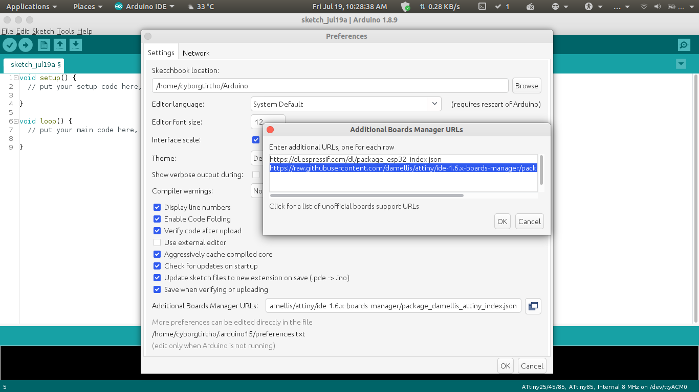
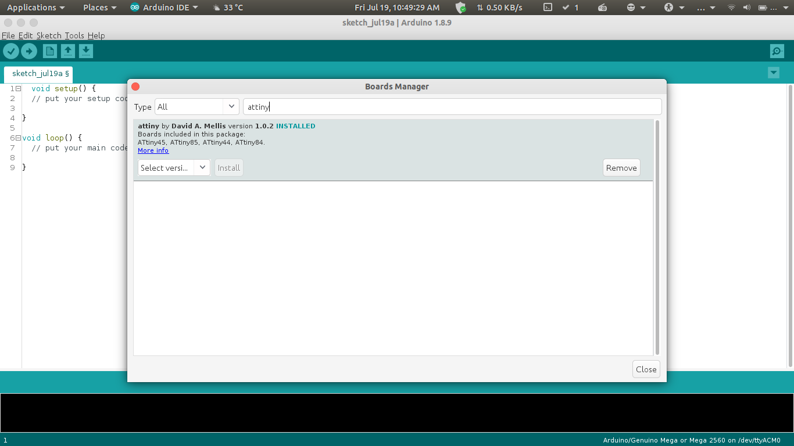
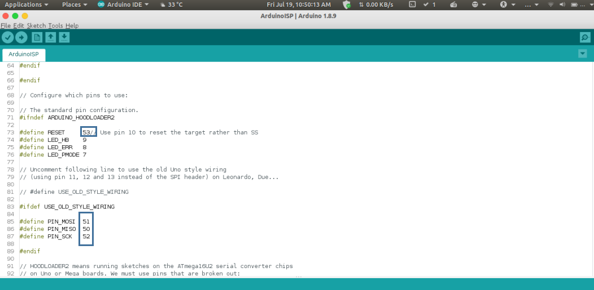
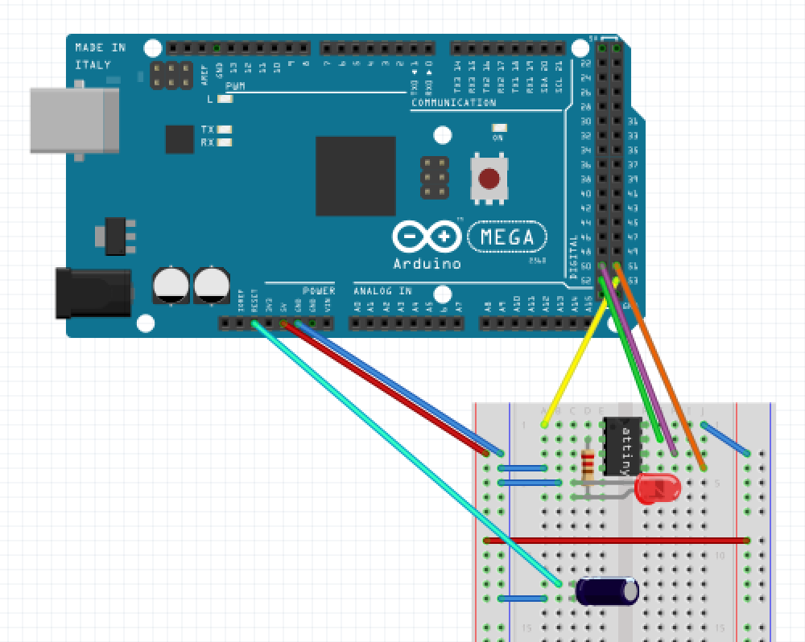

# Arduino-Mega-ATTiny85
Programming ATTiny85 using Arduino MEGA2560 as ISP.  A few months ago I was trying to shrink my Arduino project using my Attiny 85 ic. It was the first time I was trying to Program a 20u ATTiny 85 using my Arduino Mega. I had faced some problem to do so. I searched over the internet but there was no project which clearly described the method to do so. All the methods are described using Arduino Uno as ISP but not described how to use Arduino Mega as ISP. There is a little change of code in "ArduinoISP" sketch while we are using Arduino Mega as ISP. 

Process:
At first, get the ATTiny 85 support on the Arduino IDE. For this, you need to go to the 

1.File -> Preference

2.Now Click on  "Additional Boards Manager URLs" 

3.And paste the Given Link to the Box: https://raw.githubusercontent.com/damellis/attiny/ide-1.6.x-boards-manager/package_damellis_attiny_index.json

4.And then press OK.

5.Now close Arduino IDE.

6.Then start again the IDE.

7.Next goto : Tool  ->  Board  -> Board Manager

8.Now search for : attiny

9.Download and install: "attiny by Davis A. Mellis"

10.Next connect your Arduino to the computer and then Select Arduino Mega Board and also select correct port.

11.And upload the File : ArduinoISP.ino 

12.Now connect your pin as described Below:
   
        Mega Pin 51 --> ATtiny Pin 5 (MOSI)
        Mega Pin 50 --> ATtiny Pin 6 (MISO)
        Mega Pin 52 --> ATtiny Pin 7 (SCK)
        ATtiny pin 4 GND (Ground pin)
        ATtiny Pin 8 to VCC (5V)
        Mega Pin 53 --> ATtiny Pin 1 (SS)
     
     **connect a capacitor of 10uf between Ground and RESET to the Arduino Mega.
     
     
     
     
     
     
     
     
 

      
13.Now For Example,let us select LED blink sketch to upload to ATtiny 85: Open the sketch.

14.Next you need to change into the sketch to the led pin 13 to 1,because ATtiny 85 has only 8 pin so you need to change the output pin.

15.After that goto: Tools --> Board --> ATtiny25/45/85

16.Then select: Tools --> Processor --> ATtiny85

17.Set clock: Tools --> clock --> Internal 8Mhz

18.Now goto: Tools --> Programmer--> Arduino as ISP

19.Next you need to goto: Tools --> Burn Bootloader

20. All Done. :)
